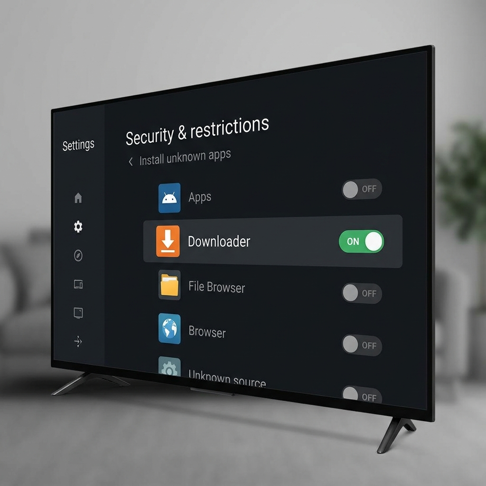
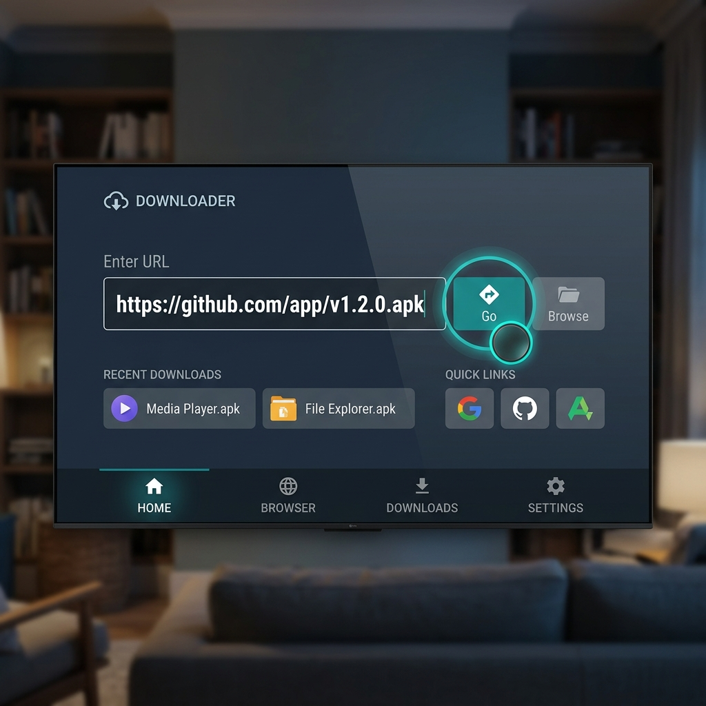

# Android TV Installation Guide

Follow these steps to download and install the **Darshini** app directly onto your Android TV or Google TV device using the GitHub release link.

---

## Prerequisites

Before starting, ensure your Android TV has a file downloader or browser installed. We recommend the popular and free **Downloader** app by AFTVnews, available directly in your TV's app store.

---

## Step 1: Allow Unknown Sources

Android TV restricts installing apps from outside the Google Play Store by default. You need to enable permission for your downloader app.

1. On your TV, navigate to **Settings** (gear icon) -> **Device Preferences** (or **System**) -> **Security & restrictions**.
2. Select **Install unknown apps**.
3. Locate the **Downloader** app (or the browser/file explorer you are using) and toggle it to **ON**.



---

## Step 2: Download the APK

1. Open the **Downloader** app on your TV.
2. In the URL input field, enter the direct download link for the pre-signed debug APK from the GitHub releases page:
   ```text
   https://github.com/SriharshaShesham/Darshini/releases/download/v1.0.0/app-debug.apk
   ```
   *(Tip: You can use a URL shortener like bit.ly to make typing the link with your TV remote much easier!)*
3. Select **Go** to start the download.



---

## Step 3: Install the App

1. Once the download completes, the Downloader app will automatically prompt you to install the APK.
2. Select **Install** on the system package installer dialog.
3. Once completed, select **Open** to launch Darshini!

> [!IMPORTANT]
> If you encounter an "App not installed" error, make sure to uninstall any existing debug or development versions of the application from your TV first.
